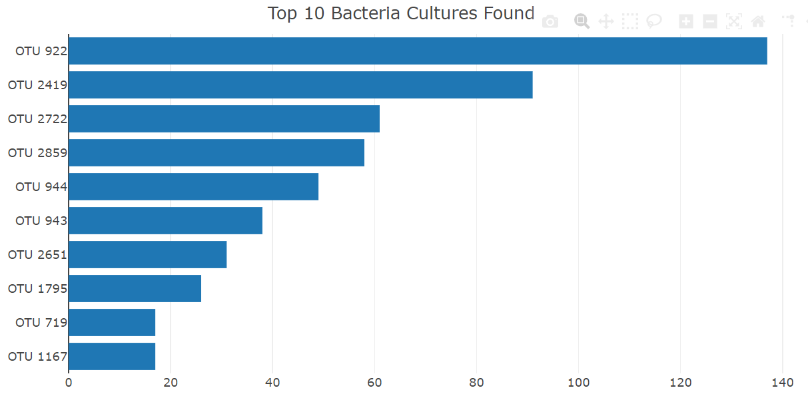
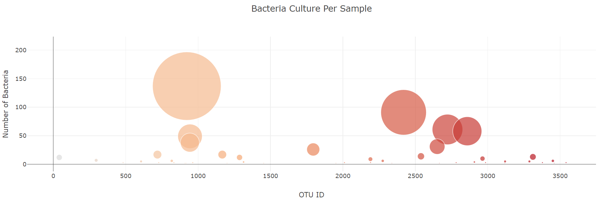
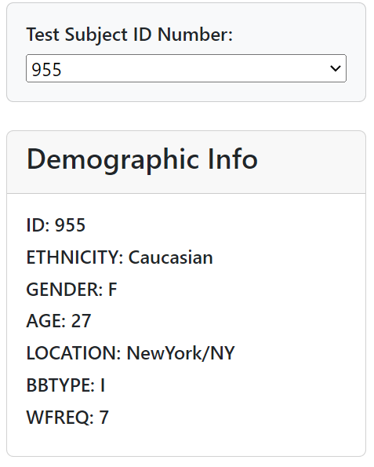

# Interactive Data Visualization and Dashboard Development
    Christopher Kellam

    Languages, Libraries, Tools Used in the project:
        Languages: JavaScript, HTML, CSS
        Libraries: D3.js, Plotly.js
        Deployment: GitHub Pages

**Project Overview**
This project used the Belly Button Biodiversity dataset, which catalogs microbes found in human navels, to build an interactive dashboard that visualizes the most prevalent microbes in an individual sample.

The dashboard includes:
-A bar chart with a dropdown menu to display the top 10 OTUs fount in that individual. 
-A bubble chart displaying the bacteria cultures per sample.
-A metadata panel that displays the individual's demographic information.
-Dynamic updates to all charts and metadata when a new sample is selected.

**1. Data Source**
The dataset used in this project was sourced from the Belly Button Biodiversity dataset [https://robdunnlab.com/projects/belly-button-biodiversity/]

The first step for the project was to read in the OTU data containing the samples and the demographic information, which was pulled from [https://static.bc-edx.com/data/dl-1-2/m14/lms/starter/samples.json]. The D3 library was used to read in the JSON file from the URL. 

**2. Visualization Features**

Horizontal Bar Chart:
The bar chart displays the top 10 OTUs found in the individual selected from the dropdown menu. X-axis: Number of bacteria found, Y-axis: OTU ID, Hovertext: Microbe species.

Example:

Bubble Chart:
The bubble chart shows all the bacterial cultures in the selected sample. X-axis: OTU IDs, Y-axis: Number of bacteria, Marker size: Sample values, Marker color: OTU IDs, Hovertext: OTU labels.

Example: 

Metadata Display:
The metadata panel shows the Id, ethnicity, gender, age, and location of the selected sample. 

Example:

**3. Dynamic Updates**
All the visualizations update when a new sample is selected from the dropdown menu. The dashboard automatically fetches the relevant data from the samples.json file and updates the charts and metadata accordingly.

**4. Deployment**
The completed dashboard is deployed to GitHub Pages. You can view the live project here: [https://kellamchris.github.io/belly_button_challenge/]